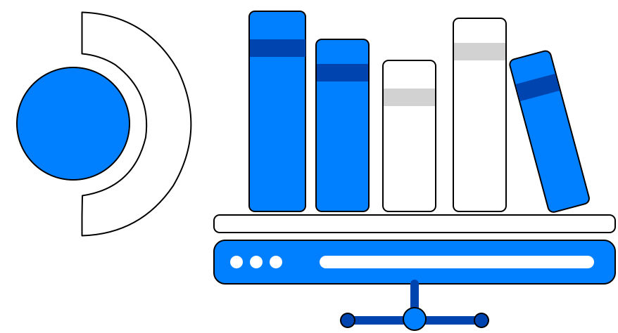

# @deck-shelves/host

<div align="center">

<p>
  
</p>

[](https://github.com/santojon/Deck-Shelves-HOST/actions/workflows/ci.yml)
[](https://github.com/santojon/Deck-Shelves-HOST/actions/workflows/release.yml)
[](https://www.npmjs.com/package/@deck-shelves/host)
[](https://www.npmjs.com/package/@deck-shelves/host)
[](https://www.npmjs.com/package/@deck-shelves/host)
[](src/contract/index.test.ts)
[](src/contract/index.ts)
[](https://bundlephobia.com/package/@deck-shelves/host)
[](LICENSE)
[](package.json)
[](https://github.com/ValveSoftware/SteamOS)
[](https://github.com/santojon/Deck-Shelves)
[](https://github.com/santojon/Deck-Shelves-HOST/network/members)
[](https://github.com/santojon/Deck-Shelves-HOST/graphs/traffic)
[](https://github.com/sponsors/santojon)
[](https://ko-fi.com/santojon)

</div>

The **host contract** for [Deck Shelves](https://github.com/santojon/Deck-Shelves) —
the `HostApi` types that both host implementations and the bundle build against.

It is the boundary between a *host* and the Deck Shelves bundle. Each host
ships its own adapter in the plugin — one file per host,
`runtime/host/<host>.ts` — and every adapter fulfils this same contract, so
the bundle's call sites never depend on a specific host and new hosts can be
added without touching the bundle.

> **Types only.** A host's *runtime* — for external hosts, the injected
> `window.__SHELVES_HOST__` that locates Steam's UI components and adds the
> Quick Access Menu tab — lives in that host's own project, not here. This
> package is just the interface both sides agree on.

> **Coexistence.** A host with a native QAM tab may also expose its panel
> registration on `window.__SHELVES_QAM__` (a `HostQam`), independently of the
> full `HostApi` — so a bundle can populate that host's tab even when *another*
> host owns the home (and `__SHELVES_HOST__` is left unset). Both globals are
> declared in the contract.

It is **not** `@deck-shelves/api` — that package is the public *extension* API
consumed by third-party plugins (`window.deckShelves`). This one is the
host↔bundle contract, a different audience.

## What's inside

| Path | What it is |
|---|---|
| `src/contract/` | **`HostApi` types** (`HOST_API_VERSION`, `lifecycle`, `rpc`, `ui`, `routes`, `notifications`, `platform`, optional `React`/`ReactDOM`/`jsx`, `qam`, `mainMenu`, `updates`). The single source of truth both hosts and the bundle build against. |

## Usage

```ts
import { HOST_API_VERSION, type HostApi } from "@deck-shelves/host";
```

## Build

```
pnpm install
pnpm build      # tsup → dist/index.{js,cjs,d.ts}
pnpm check      # typecheck + lint + test
```

## License

[MIT](LICENSE) © [santojon](https://github.com/santojon)
